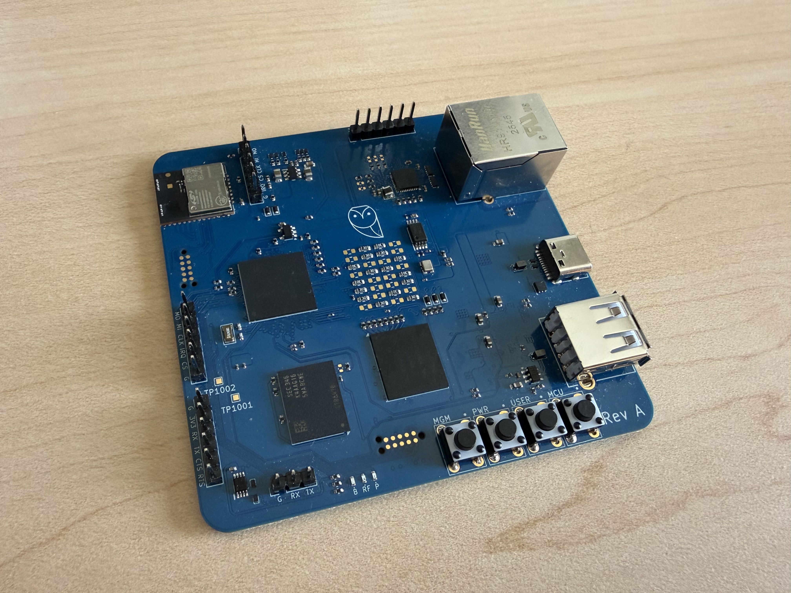
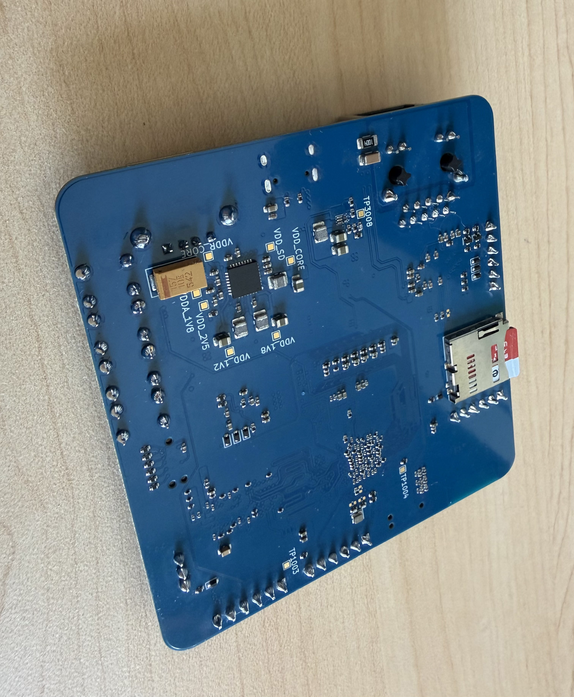
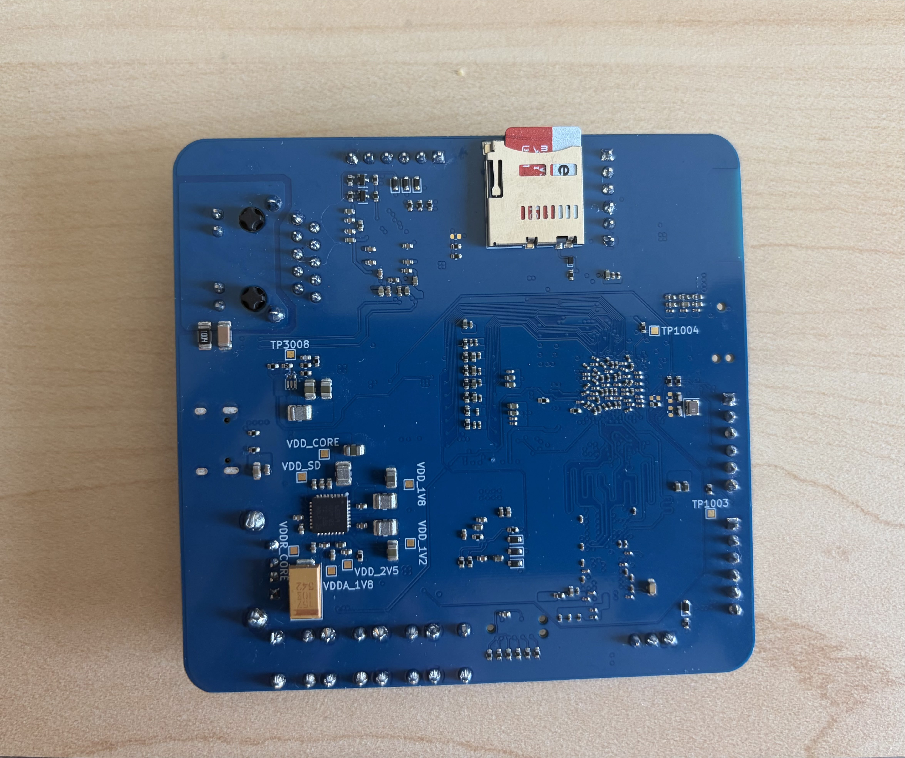
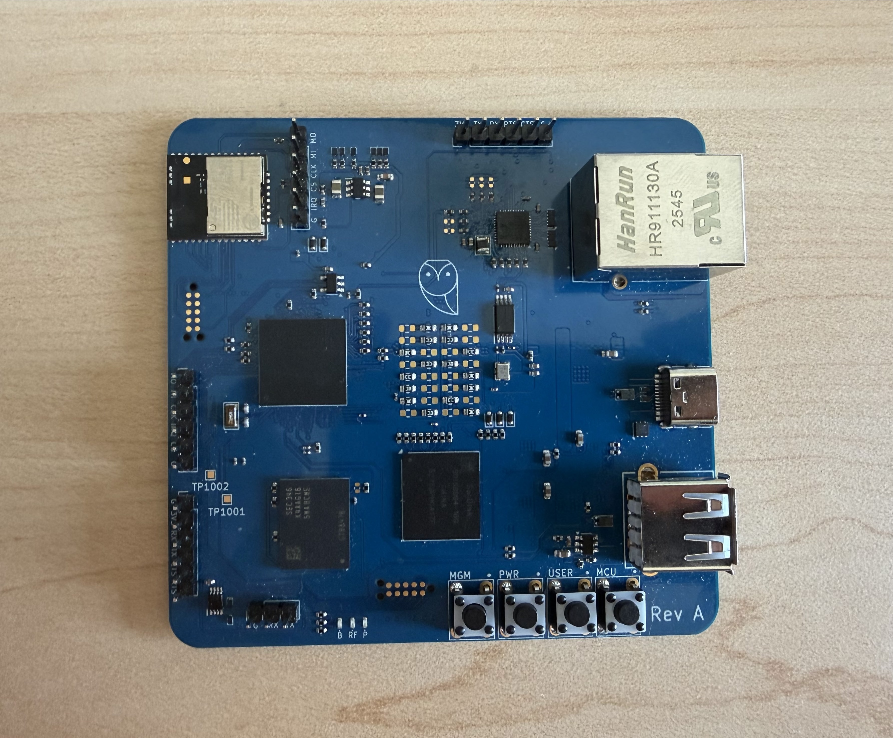

# Leonhart
## Overview
Leonhart is a custom embedded Linux board based on the Texas Instruments AM6231 SoC.

The goal of this design was to build a fully functional Linux system that utilizes the on board Silicon Labs MGM240P module to host Zigbee and Thread networks simultaneously for smart homes.

  

## Key Features
- TI AM6231 SoC
- 2 GB DDR4
- SiLabs MGM240P RF module
- 16 GB eMMC storage (HS200)
- MicroSD interface
- Ethernet (RGMII PHY)
- 32kB EEPROM
- USB-A host port
- USB-C power input
- SoC JTAG/MGM240P SWD TagConnect debug interfaces
- SPI and UART header pins for extra peripherals

## Rev A Progress
### Working
- PMIC rails come up correctly
- U-Boot boot via UART
- DDR initialization and simple read/write commands
- eMMC detected and operating at HS200
- 25 MHz CMOS oscillator and dual channel buffer
- EEPROM communication

### In Progress / Issues
- 5V -> 3.3V buck converter footprint issue. Separate 3.3V injection used to power board
- USB-C sending incorrect voltage
- Ethernet PHY not yet operational (most likely configuration issue)

## Bring-Up Notes

During initial bring-up, a bench PSU was used and a large current draw was observed, which was then found out to be an issue with the 5V -> 3.3V buck converter footprint.

A temporary workaround involved:
- Injecting 3.3V from wall adapter into 3.3V header pin
- Using a USB-C breakout board to power the PMIC and remaining rails via a bench PSU

This allowed for successful validation of:
- SoC boot
- DDR initialization
- eMMC communication

## Hardware Photos

  
  

  
  

