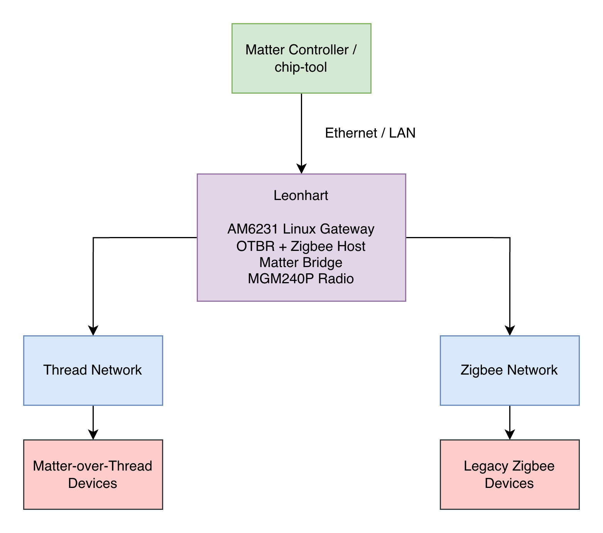
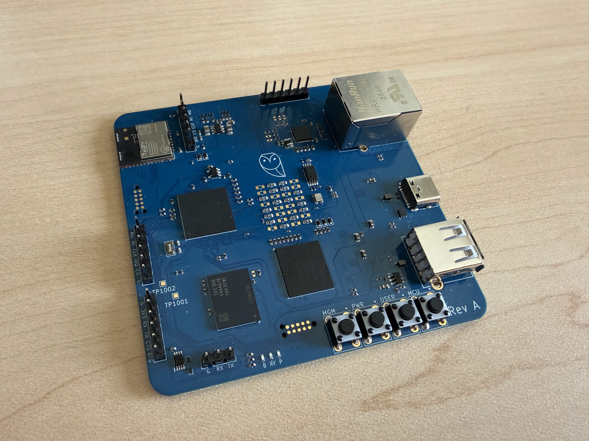
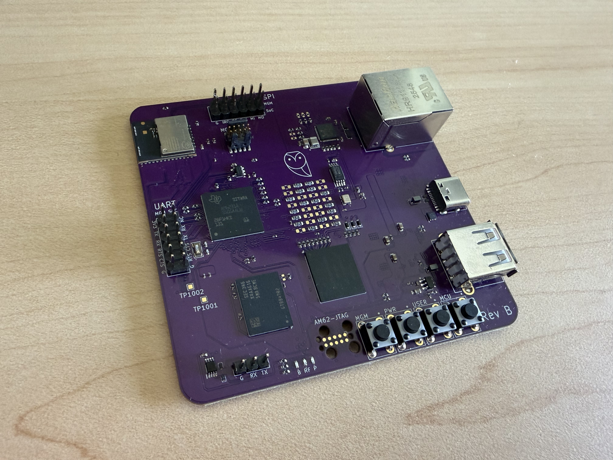
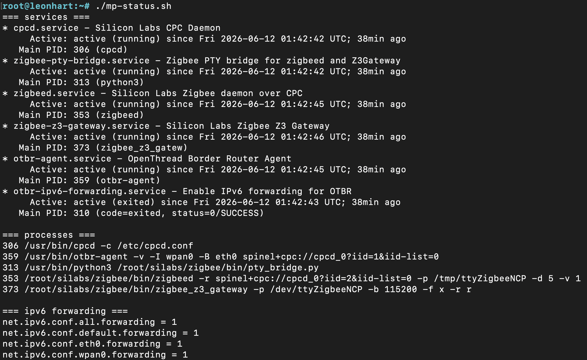
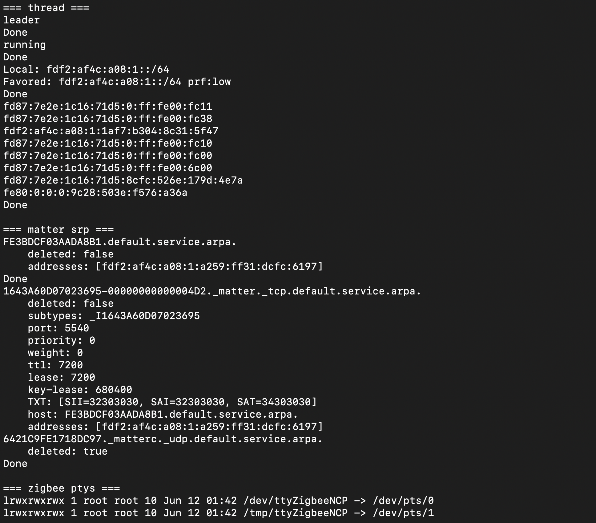
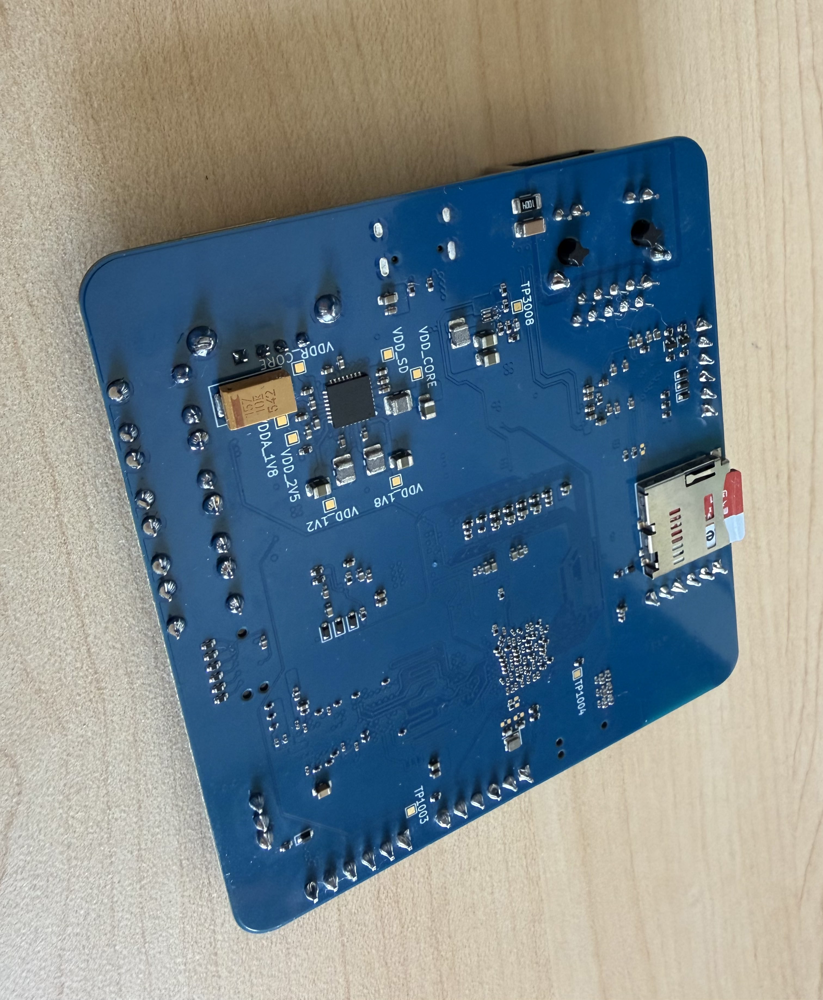
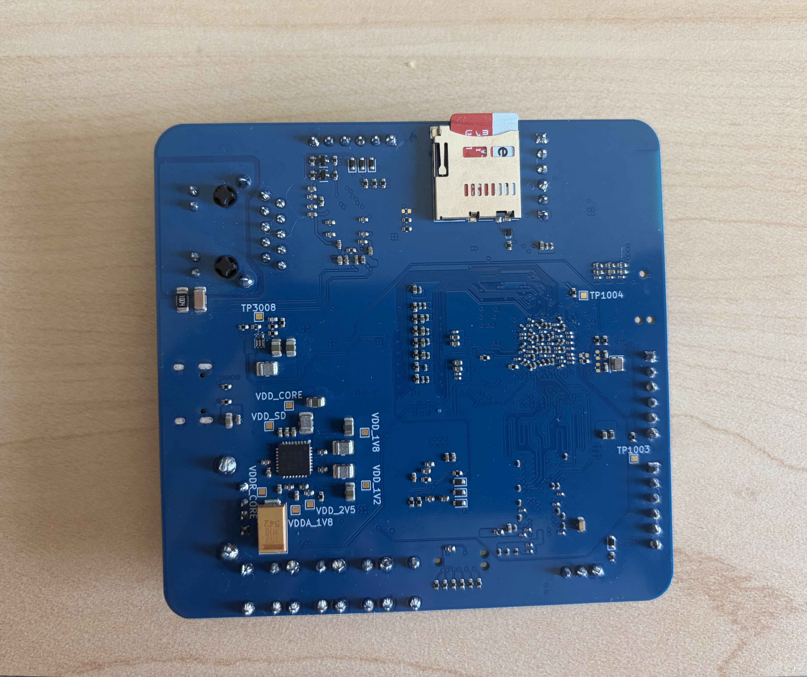
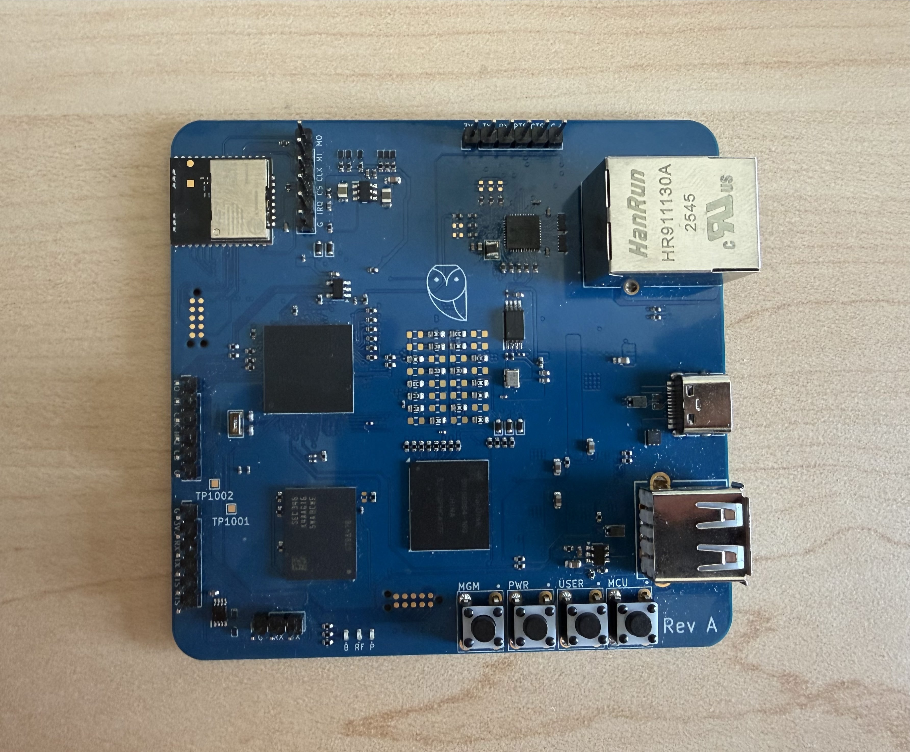

# Leonhart
## Overview
Leonhart is a custom embedded Linux board based on the Texas Instruments AM6231 SoC.

The board is a smart-home gateway capable of running Linux and hosting Thread and Zigbee networks simultaneously using the Silicon Labs MGM240P radio module. The goal is to provide support for Matter-over-Thread devices while also bridging Zigbee devices into modern Matter-based ecosystems such as Google Home, Amazon Alexa, and Apple Home.

## Project Goals

The main goals of Leonhart are:
- Build a fully functional custom embedded Linux system
- Run Zigbee+Thread RCP firmware on MGM240P
- Thread Border Router functionality
- Zigbee network stack to communicate with radio
- Support multi protocol through Silicon Labs CPC
- Create a compact, local and open Linux-based alternative to separate Zigbee hubs and Thread border routers

## Current Status

Rev B is currently functional. Working features include:
- Linux boot from eMMC
- Ethernet and SSH
- USB-C powered boot
- Multiprotocol firmware flashed to MGM240P
- UART communication between Linux host and MGM240P with hardware flow control
- Silicon Labs CPC daemon communication
- OpenThread Border Router operation
- Thread and Zigbee network formation
- Automatic startup of Zigbee, OTBR and CPC services
- Matter-over-Thread device control using chip-tool
- Zigbee device control through Matter chip-tool commands using a simple FIFO-based Matter bridge

The current working demo

  

## Rev A

  

## Rev B

  

## Key Features
- TI AM6231 SoC
- 2 GB DDR4
- SiLabs MGM240P RF module
- 16 GB eMMC storage (HS200)
- Ethernet (RGMII PHY)
- 32kbit EEPROM
- USB-A host port
- USB-C power input
- SoC JTAG/MGM240P SWD TagConnect debug interfaces
- SPI and UART header pins for extra peripherals

## Rev A Progress
### Working
- PMIC rails come up correctly
- U-Boot boot via UART
- DDR initialization and simple read/write commands
- eMMC detected and operating at HS200
- 25 MHz CMOS oscillator and dual channel buffer
- EEPROM communication
- USB-A controller
- Linux boot

### In Progress / Issues
- 5V -> 3.3V buck converter footprint issue. Separate 3.3V injection used to power board
- USB-C sending incorrect voltage
- Ethernet PHY not yet operational (most likely configuration issue)
- Linux boot on power up may have to wait until Rev B because of bodged power up sequencing
- On board MGM240P UART and SWD pinout is incorrect

## Rev B Progress
### Fixed from Rev A
- MGM240P pinout now correct and can be flashed to via Silicon Labs J-Link debugger
- Buck converter footprint now correct and no power bodging required
- Ethernet and SSH works
- Linux boot on power up now works

## Bring-Up Notes

Progress Update #1 

During initial bring-up, a bench PSU was used and a large current draw was observed, which was then found out to be an issue with the 5V -> 3.3V buck converter footprint.

A temporary workaround involved:
- Injecting 3.3V from wall adapter into 3.3V header pin
- Using a USB-C breakout board to power the PMIC and remaining rails via a bench PSU

This allowed for successful validation of:
- SoC boot
- DDR initialization
- eMMC communication

Linux boot strategy: USB-A -> DDR -> eMMC -> DDR -> boot

Progress Update #2
- Successfully booted Linux (Arago distribution)
- Rootfs and U-Boot files copied to eMMC
- Successfully able to boot from eMMC

Progress Update #3
- Modified prebuilt ti-am625-sk.dts file with only UART pinmux (UART5) for my custom board, and build .dtb file from that, then copied it to eMMC
- Tested UART5 communication with Sparkfun Things Matter MGM240P and saw output on SOC UART terminal

Progress Update #4
- Had issue with USB C power showing incorrect voltage for 5V rail (2.2V), so I used the bench power supply for dummy power. I have found that the bodged 3.3V injection setup causes the 2.2V at the USB C VBUS pins, which prevents USB C from sending power. Without the bodged setup (correct 5V->3.3V buck converter footprint) in the next revision, USB C power should work as intended
- Created new Rev B branch and started revisions

Progress Update #5 (Rev B)
- Confirmed gigabit Ethernet works and SSH works
- Linux able to boot from power up
- Confirmed onboard MGM240P communication and flashing works
- Confirmed UART hardware flow with MGM240P works
- Need to fix NCP and RCP firmware communication with CPC daemon

Progress Update #6 (Rev B)
- Successfully flashed Multiprotocol RCP/NCP (Thread and Zigbee) stack to MGM240P and had successful communication with host CPCD
- Successfully proved full Thread network chain (RCP(MGM) <-> (CPCD <-> OTBR)(AM6231)). Needed to rebuild TI Arago Linux image with multicast routing enabled

Progress Update #7 (Rev B)
- Made all Zigbee (zigbeed, zigbee-pty-bridge, Z3Gateway), Thread (OTBR, otbr-agent) and CPCD run on reboot, and successfully confirmed services correctly restart and devices reconnect
- Successfully proved Matter-over-Thread control with ESP32C6 running a Matter light example

Current working demo path is:

	Ubuntu PC running chip-tool
        	    |
        	    |  (Ethernet)
        	    V
		 Leonhart
		    |- Linux
		    |- cpcd
		    |- otbr-agent/OTBR
       		    |- MGM240P multiprotocol radio
		    		  |
		    		  |  (Thread)
		    		  V
			 ESP32-C6 Matter Light

The ESP32 commissions onto the Thread network through Leonhart, then registers its Matter operational service through SRP, then can be controlled from chip-tool over the LAN

Next steps
- Order more Zigbee and Matter-over-Thread and stress test the multiprotocol networking
- Begin to start/look into Zigbee -> Matter bridging

The following screenshots shows a script that displays the status' of the Zigbee and Thread networks and services:

  

  

## Hardware Photos

  
  

  
  

